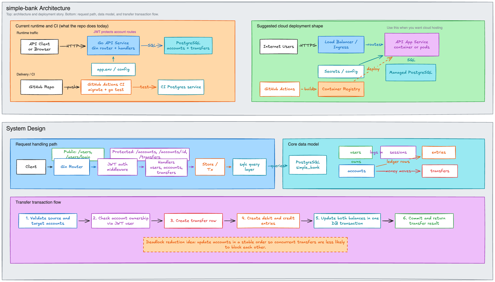

# simple-bank

Product name: `simple-bank`.
Repository name: `simple-bank`.
GitHub repository: [matoanbach/simple-bank](https://github.com/matoanbach/simple-bank)

`simple-bank` is a backend engineering project that simulates core banking workflows such as user registration, login, account management, and money transfers.

It was built as a hands-on learning project to practice API development, database design, transaction handling, authentication, testing, and deployment workflows using Go and PostgreSQL.

This README documents the original implementation preserved in `archive/`. The repository root contains newer rebuild work, but `archive/` is the reference implementation described here: a Go backend backed by PostgreSQL, with a gRPC service, an HTTP JSON gateway, Swagger docs, session-backed authentication, transactional transfer logic, and AWS deployment configuration.

## What It Does

This project includes:
- User registration with password hashing.
- User login with PASETO access and refresh tokens.
- Session storage for login tracking and refresh-token validation.
- Authenticated user profile updates through the gRPC service.
- HTTP JSON access to the gRPC API through `grpc-gateway`.
- Swagger documentation served by the application.
- A legacy Gin REST layer in `archive/api/` for accounts, token renewal, and money transfers.
- PostgreSQL migrations, generated query code, automated tests, and deployment manifests.

In plain terms, the archived implementation behaves like a small banking backend with two transport layers: the main runtime exposes user flows through gRPC plus an HTTP gateway, while the older Gin layer contains the account and transfer endpoints that complete the banking workflow.

## Why I Built It

I built `simple-bank` to get hands-on practice with backend and cloud-adjacent engineering topics instead of only learning them in theory.

The project helped me work through:
- designing gRPC and REST API endpoints
- structuring Go application code
- writing SQL schema and queries
- generating typed database access code with `sqlc`
- generating protobuf, gateway, and Swagger artifacts
- handling password hashing and PASETO authentication
- implementing transactional money movement safely
- running tests against PostgreSQL
- packaging the service with Docker and preparing AWS deployment workflows

## Skills Demonstrated

- Go backend development
- gRPC API design
- HTTP JSON gateway integration with `grpc-gateway`
- PostgreSQL schema design and migrations
- transactional SQL workflow design
- authentication and session concepts
- automated testing
- CI/CD with GitHub Actions
- Docker, Kubernetes manifests, and AWS deployment workflow basics

## Tech Stack

- Go
- Gin
- gRPC
- `grpc-gateway`
- Protocol Buffers
- PostgreSQL
- `sqlc`
- `golang-migrate`
- `bcrypt`
- PASETO
- Viper
- Zerolog
- Docker
- GitHub Actions
- AWS ECR and EKS

## Architecture

This diagram is split into two layers so both non-technical and technical readers can understand the project quickly.

- Top half: the archived runtime, CI workflow, and AWS deployment shape.
- Bottom half: internal request flow, core database model, and transfer transaction design.



## Project Layout

- App entrypoint: `archive/main.go`
- gRPC service handlers: `archive/gapi/`
- Protobuf contracts: `archive/proto/`
- Generated protobuf and gateway code: `archive/pb/`
- Legacy Gin REST API: `archive/api/`
- Database migrations: `archive/db/migration/`
- SQL queries for `sqlc`: `archive/db/query/`
- Generated DB code + store logic: `archive/db/sqlc/`
- Config and utility helpers: `archive/db/util/`
- Token/auth code: `archive/token/`
- Embedded Swagger assets: `archive/doc/swagger/`
- Deployment manifests: `archive/eks/`
- CI/CD workflows: `archive/.github/.github/workflows/`
- Images used in the README: `images/`

## Run Locally

Requirements:
- Go `1.23.x`
- Docker
- `migrate` CLI if you want to run the Makefile migration commands manually outside the container workflow
- `protoc` and related plugins only if you want to regenerate protobuf and Swagger artifacts

Commands:

```bash
cd archive
docker compose up --build
```

The containerized app runs migrations on startup, waits for PostgreSQL, and starts the archived runtime.
In the provided Compose file, the HTTP gateway is exposed on port `8080`; the gRPC server still runs inside the app on port `9090`, but that port is not published by default.

Then open the API locally at:

```text
http://localhost:8080
```

Swagger is served at:

```text
http://localhost:8080/swagger/
```

Useful commands:

```bash
cd archive
make sqlc
make proto
make test
```

If you run `archive/main.go` directly with a reachable PostgreSQL instance, you can also use `make evans` to connect to the gRPC server on `localhost:9090`.

## Environment Variables

The archived implementation includes an `archive/app.env` file with local development values.

Key settings in that file include:
- `ENVIRONMENT`
- `DB_DRIVER`
- `DB_SOURCE`
- `MIGRATION_URL`
- `HTTP_SERVER_ADDRESS`
- `GRPC_SERVER_ADDRESS`
- `TOKEN_SYMMETRIC_KEY`
- `ACCESS_TOKEN_DURATION`
- `REFRESH_TOKEN_DURATION`

Technical note:
- `archive/main.go` loads config from `archive/app.env`, uses those values to connect to PostgreSQL, and runs migrations before starting the gateway and gRPC servers.
- `archive/docker-compose.yaml` overrides `DB_SOURCE` inside the API container so the service can connect to the `postgres` container by hostname.

## API Summary

Primary archived runtime routes exposed through `grpc-gateway`:

| Method | Route | Purpose |
|---|---|---|
| `POST` | `/v1/create_user` | Register a new user |
| `POST` | `/v1/login_user` | Log in and receive access and refresh tokens |
| `POST` | `/v1/update_user` | Update the authenticated user's profile or password |

Legacy Gin REST routes still present in `archive/api/`:

| Method | Route | Purpose |
|---|---|---|
| `POST` | `/users` | Register a new user |
| `POST` | `/users/login` | Log in and receive tokens |
| `POST` | `/tokens/renew_access` | Exchange a refresh token for a new access token |
| `POST` | `/accounts` | Create an account for the authenticated user |
| `GET` | `/accounts/:id` | Get a single account if it belongs to the authenticated user |
| `GET` | `/accounts` | List accounts for the authenticated user |
| `POST` | `/transfers` | Transfer money between accounts |

In `archive/main.go`, the primary runtime is the gRPC server plus HTTP gateway. The Gin router remains in the archive as an older transport layer and is not the server started by default.

## Data Model

The implemented database schema is centered around five main tables:

- `users`: login identity and profile information
- `accounts`: bank accounts owned by users
- `entries`: debit and credit records tied to accounts
- `transfers`: transfer records between source and destination accounts
- `sessions`: stored login sessions and refresh-token metadata

At a high level:
- a user can own one or more accounts
- a transfer creates movement between two accounts
- each transfer also creates matching accounting entries
- sessions are stored so refresh-token use can be validated against persisted session records

The DBML in `archive/doc/db.dbml` also sketches a `verify_emails` table as a design direction, but the implemented migrations in `archive/db/migration/` currently create the five tables listed above.

## Authentication and Security

The archived implementation includes:
- password hashing with `bcrypt`
- PASETO token creation and validation
- short-lived access tokens plus longer-lived refresh tokens
- session persistence for refresh-token validation
- gRPC authorization checks for authenticated user updates
- metadata capture such as user agent and client IP when sessions are created

This means the project is not just a CRUD demo. It includes practical token, session, and authorization behavior that is closer to a real backend service.

## Transaction Design

The most important banking workflow in the archived project is the transfer transaction implemented in `archive/db/sqlc/store.go` and used by the legacy Gin REST layer.

When a transfer is created, the application:
- creates a transfer record
- creates a debit entry for the source account
- creates a credit entry for the destination account
- updates both account balances inside a database transaction

The custom store logic also updates accounts in a stable order to reduce deadlock risk during concurrent transfers.

That logic lives in `archive/db/sqlc/store.go`.

## Testing and CI

Automated tests in the archived implementation cover several layers of the system.

The test suite includes:
- database CRUD tests for accounts, entries, users, and transfers
- store-level transfer transaction tests
- token tests
- legacy Gin API tests for middleware and selected handlers

CI workflow:
- Test file: `archive/.github/.github/workflows/test.yml`
- Trigger: pushes and pull requests targeting `main`
- It starts PostgreSQL, runs migrations, and executes `make test`

Deployment workflow:
- Deploy file: `archive/.github/.github/workflows/deploy.yaml`
- GitHub Actions authenticates to AWS, loads runtime config from AWS Secrets Manager, builds and pushes a Docker image to Amazon ECR, updates kubeconfig for Amazon EKS, and applies the Kubernetes manifests.
- The workflow also applies `archive/eks/aws-auth.yaml`, which is the key IAM-to-Kubernetes bridge in this repo.
- In that file, the EKS worker-node role `AWSEKSNodeRole` is mapped into Kubernetes node groups, and the IAM user `github-ci` is mapped to `system:masters` for deployment access.

## Technical Notes

This section is for engineers who want a more implementation-focused view.

### HTTP Layer

The primary archived transport is an HTTP JSON gateway generated from protobuf annotations and backed by the gRPC server implementation.

Key files:
- `archive/main.go`
- `archive/gapi/server.go`
- `archive/proto/service_simple_bank.proto`
- `archive/pb/`
- `archive/doc/swagger/`

The project also contains a legacy Gin transport in `archive/api/` that exposes banking endpoints such as accounts, transfers, and token renewal.

### Database Layer

The project uses:
- SQL migrations for schema changes
- handwritten SQL queries in `archive/db/query/`
- generated Go bindings via `sqlc`
- a custom `Store` type for transaction orchestration

This keeps SQL explicit while still giving typed Go accessors and a dedicated place for multi-step transaction logic.

### Token Layer

The token package provides:
- a token maker interface
- an active PASETO implementation used by the archived runtime
- a JWT implementation kept in the package as an alternate approach
- token payload validation

This keeps authentication logic isolated from the transport handlers while making it easy to compare token strategies.

### AWS and IAM Notes

The archived deployment flow is also a useful small IAM review example because it touches AWS identity, EKS authentication, and Kubernetes authorization boundaries.

Key files:
- `archive/.github/.github/workflows/deploy.yaml`
- `archive/eks/aws-auth.yaml`

What the deployment flow shows:
- GitHub Actions first authenticates to AWS.
- The workflow then reads configuration from AWS Secrets Manager.
- It logs in to Amazon ECR and pushes the application image.
- It calls `aws eks update-kubeconfig` so the CI runner can talk to the EKS control plane.
- It applies `aws-auth.yaml`, which maps AWS IAM identities into Kubernetes usernames and groups.

IAM details visible in the repo:
- The archived workflow currently uses long-lived AWS access keys stored in GitHub secrets: `AWS_ROOT_ACCESS_KEY` and `AWS_ROOT_SECRET_ACCESS_KEY`.
- The workflow includes commented `role-to-assume` lines, which point to a more production-ready IAM pattern based on role assumption instead of static credentials.
- `archive/eks/aws-auth.yaml` maps the IAM role `arn:aws:iam::160885278762:role/AWSEKSNodeRole` to Kubernetes node groups such as `system:bootstrappers` and `system:nodes`.
- The same file maps the IAM user `arn:aws:iam::160885278762:user/github-ci` to the Kubernetes group `system:masters`, which is effectively cluster-admin level access.

IAM concepts this project helps review:
- The difference between AWS authentication and Kubernetes authorization.
- The difference between a worker-node role and a CI deployment identity.
- How EKS uses the `aws-auth` ConfigMap to translate IAM identities into Kubernetes RBAC groups.
- Why Secrets Manager, ECR, and EKS access should normally be scoped through least-privilege IAM policies.
- Why static AWS keys are weaker than OIDC federation plus `sts:AssumeRole` for CI systems.

Practical IAM/SRE takeaways:
- This repo shows the path from CI identity to cloud API access to cluster-admin style authorization.
- It is a good example of where blast radius can become too broad if CI is mapped to `system:masters`.
- It is also a good example of an improvement path: replace static credentials with GitHub OIDC, assume a dedicated deployment role, and narrow both IAM permissions and Kubernetes RBAC scope.

## What To Improve

Engineering quality:
- Decide whether to consolidate around the gRPC plus gateway stack or fully restore the legacy Gin banking API as a first-class runtime.
- Expand automated tests around the gRPC handlers in addition to the existing DB, token, and legacy API coverage.
- Expose the gRPC port in Docker Compose for easier local gRPC client testing.
- Tighten documentation around local bootstrap, code generation, and deployment prerequisites.

Architecture and product behavior:
- Extend the gRPC surface beyond user create, login, and update flows if rebuilding the banking features on that transport.
- Clarify whether future work should revive design-only features such as email verification.
- Improve the boundary between archived reference code and new rebuild work so the active learning path is clearer.

Deployment and operations:
- Document the AWS infrastructure assumptions behind the ECR, EKS, and Secrets Manager workflow more explicitly.
- Replace static AWS credentials in CI with GitHub OIDC plus `sts:AssumeRole`, and narrow the IAM and Kubernetes permissions granted to the deployment identity.
- Add a simpler local setup path for developers who want to run Postgres outside Docker.

## Summary

`simple-bank` is a backend practice project that demonstrates API development, authentication, SQL schema design, transactional money movement, testing, code generation, and deployment using Go and PostgreSQL.

For non-technical readers, it shows a practical banking-style backend.
For technical readers, the archived implementation in `archive/` shows how I combined gRPC, an HTTP gateway, SQL-driven data access, session-backed authentication, transaction safety, CI, and AWS-oriented deployment workflows.
